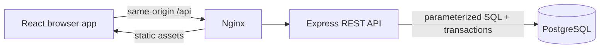

# AccessFlow

AccessFlow is a full-stack employee access-request application built for the Fullstack Developer Technical Assessment. It provides pre-created accounts, authentication, role-aware authorization, request CRUD, a manager-then-admin approval workflow, an audit history, and the optional live dashboard.

## Assessment coverage

| Requirement | Implementation |
| --- | --- |
| Login, no registration | Seeded accounts and `POST /api/auth/login` |
| `USER`, `MANAGER`, and `ADMIN` roles | PostgreSQL enum, JWT claims, team relationship, and API authorization middleware |
| Request access | Active catalog, access selection, reason validation, submission |
| My Requests | ID, access, reason, date, detailed status, edit, and withdraw |
| Manager approval | Queue is limited to employees whose `manager_id` is the signed-in user |
| Admin approval | Queue is limited to manager-approved requests and `ADMIN` users |
| Two required approvals | Transactional state machine; manager approval stays `IN_PROGRESS` |
| Frontend / API / database | React SPA / Express REST API / PostgreSQL migrations |
| CRUD | Create, read, update, and safe withdrawal of requests; admin catalog CRUD API |
| Bonus dashboard | Fresh database aggregates, refreshed in the UI every 15 seconds |
| Security aspect | Bcrypt, JWT, rate limiting, Zod, parameterized SQL, RBAC, row locks, Helmet, CORS |

## Technology stack

- **Frontend:** React 19, TypeScript, Vite, React Router, TanStack Query, Lucide icons, responsive CSS
- **Backend:** Node.js 22, Express 5, TypeScript, Zod, JSON Web Tokens, bcrypt
- **Database:** PostgreSQL 17, versioned SQL migrations, constraints and indexes
- **Operations:** Docker Compose, Nginx reverse proxy, health checks, multi-stage image builds
- **Quality:** TypeScript strict mode and Vitest

### Project structure

```text
backend/                 Express API, authorization, workflow, and tests
frontend/                React pages, components, interactions, and styling
database/migrations/     Versioned schema and demo-data seed migrations
docs/                    OpenAPI contract and implementation walkthrough
scripts/                 Reproducible end-to-end smoke test
docker-compose.yml       PostgreSQL, API, and Nginx/React orchestration
```

### Why this stack

The assessment allows any stack. React and Express keep the demonstration focused on domain and security decisions while still giving the frontend and backend a clear boundary. PostgreSQL is a strong fit because approvals need transactions, row locking, foreign keys, check constraints, and durable audit data. Raw parameterized SQL keeps the data model visible to a reviewer instead of hiding the important workflow behind an ORM.

## Architecture



The browser never decides whether a request may be approved. It only displays the queue returned by the API. Every decision is authorized again inside a database transaction, where the request row is locked to prevent two reviewers from changing the same stage concurrently.

## Run with Docker (recommended)

Prerequisite: Docker Desktop.

```bash
docker compose up --build
```

Open <http://localhost:8088>. The database migrations and demo data are applied automatically. Port 8088 was selected to avoid the common local conflict on port 8080.

To choose another web port in PowerShell:

```powershell
$env:WEB_PORT=8090
docker compose up --build
```

Stop the application without deleting its database:

```bash
docker compose down
```

Use `docker compose down -v` only when a complete demo-data reset is intended.

### Docker build troubleshooting

The root manifest intentionally pins `@rollup/rollup-linux-x64-musl` as an optional dependency. npm can omit Rollup's Alpine binary when `package-lock.json` is generated on Windows, which otherwise causes the frontend image to fail with `Cannot find module @rollup/rollup-linux-x64-musl`. Keeping it optional means Windows skips the binary locally while Alpine installs it during `npm ci`.

## Demo accounts

All demo accounts use password `Password123!`.

| Persona | Email | What to demonstrate |
| --- | --- | --- |
| Employee | `alice.user@accessflow.dev` | Create, view, edit, and withdraw an early-stage request |
| Manager | `bob.manager@accessflow.dev` | See and decide requests from Alice and Diego only |
| Administrator | `carol.admin@accessflow.dev` | Decide manager-approved requests and manage the catalog |

These are development-only credentials. The seed migration must not be used in a production environment.

Only login accounts and the four requestable access types are seeded. `access_requests` and `approvals` start with zero rows; request data appears only after an employee submits through the application.

## Local development

Prerequisites: Node.js 22, npm, and Docker Desktop.

```bash
docker compose up -d database
copy .env.example .env
npm install
npm run migrate
npm run dev
```

Then open <http://localhost:5173>. Vite proxies `/api` to <http://localhost:3000>. The PostgreSQL container is exposed on local port 5433 so it is less likely to conflict with an existing installation. Set `DB_PORT` and update `DATABASE_URL` if another port is needed.

Useful commands:

```bash
npm run typecheck
npm test
npm run build
npm run smoke    # with the Docker stack running
```

The smoke test creates one approved request and one rejected request. Reset that disposable test data with `docker compose down -v` followed by `docker compose up -d --build`.

## Approval model

The public status and internal stage are deliberately separate:

| Current state | Allowed reviewer/action | Next state |
| --- | --- | --- |
| `IN_PROGRESS / MANAGER` | Assigned manager approves | `IN_PROGRESS / ADMIN` |
| `IN_PROGRESS / MANAGER` | Assigned manager rejects | `REJECTED / COMPLETE` |
| `IN_PROGRESS / ADMIN` | Administrator approves | `APPROVED / COMPLETE` |
| `IN_PROGRESS / ADMIN` | Administrator rejects | `REJECTED / COMPLETE` |
| Any final state | No decisions allowed | Unchanged (`409`) |

`MANAGER` is an explicit role, while team ownership is independently modeled through `users.manager_id`. Both checks are required: a manager can review only requests from their direct reports, not requests from every team. `ADMIN` remains the organization-level role for final approval.

### CRUD rules

- **Create:** any active user with an assigned manager can submit an active access type.
- **Read:** requesters see their own requests; assigned managers and administrators can inspect relevant requests.
- **Update:** the requester can edit the reason only while waiting for manager review.
- **Delete/withdraw:** the same early-stage rule applies. The operation is a soft cancellation (`CANCELLED`) so audit data is not destroyed.
- **Catalog:** administrators can create, update, disable, and restore access types. Disabling is also soft so historical requests remain valid.

## Security aspect

- Passwords are stored as bcrypt hashes with cost 12 and never returned by the API.
- JWTs expire after eight hours; the API validates signature, subject, email, and role.
- Login is rate-limited to ten attempts per fifteen minutes.
- All request bodies, URL IDs, lengths, and enums are validated with Zod.
- SQL is parameterized; the schema also enforces foreign keys, enums, lengths, uniqueness, and valid status/stage combinations.
- Authorization is server-side. Queue filtering in the UI is not treated as a security boundary.
- Self-approval is forbidden, even if the requester is also a manager or administrator.
- Approval writes occur in one transaction with `SELECT ... FOR UPDATE`, preventing stale or simultaneous decisions.
- Each decision records approver, level, action, note, and timestamp.
- Helmet security headers, a strict JSON size limit, explicit CORS origins, and an Nginx boundary reduce common HTTP risks.

For a production release, replace demo credentials and the JWT secret, terminate HTTPS, use secure `HttpOnly`/`SameSite` cookies plus CSRF protection instead of browser local storage, add token revocation/rotation, connect corporate SSO/MFA, centralize audit logs, add notification jobs, and manage secrets outside source control.

## API and database

The complete API contract is in [`docs/openapi.yaml`](docs/openapi.yaml). Migrations are applied in filename order and recorded in `schema_migrations`:

- `001_schema.sql` creates three roles, users, catalog items, requests, approval audit rows, constraints, and indexes.
- `002_seed.sql` creates four access types plus employee, manager, and administrator accounts. It intentionally creates no request or approval records.
- `003_add_manager_role.sql` and `004_promote_seed_manager.sql` safely upgrade databases created before the explicit manager role was added.

Core tables:

- `users`: identity, global role, and manager relationship
- `access_types`: requestable catalog with soft enable/disable
- `access_requests`: business reason, visible status, current stage, version, timestamps
- `approvals`: immutable decision history, unique per request and level
